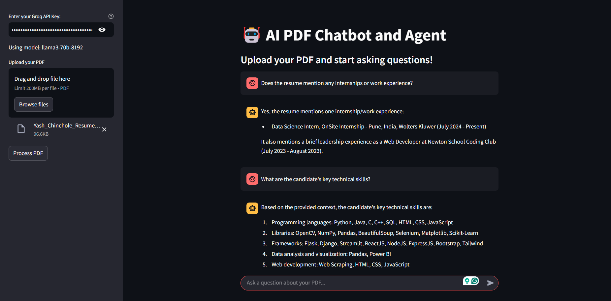
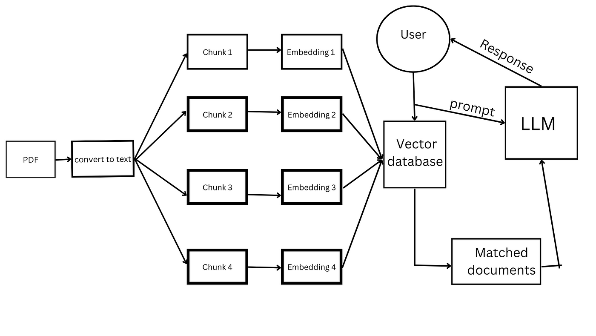

# AI PDF Chatbot and Agent

## Description

The **AI PDF Chatbot and Agent** is a powerful web-based application designed to enable interactive querying over PDF files. It leverages Large Language Models (LLMs), vector databases, and embedding techniques to create an intelligent chatbot that understands and responds to user questions based on the content of uploaded PDFs.

## Live Website

Try the live demo: [AI PDF Chatbot and Agent](https://ai-pdf-chatbot-and-agent.onrender.com)

## Screenshot of Website

Here’s a glimpse of the interface:

## Repository Link

Explore the complete codebase on GitHub: [AI PDF Chatbot and Agent](https://github.com/yashchinchole/AI-PDF-Chatbot-and-Agent)

---

## Features and Key Points

❑ **Context-Aware Chatbot**: Uses vector similarity search with LLaMA 3 - 70B to deliver accurate, context-rich responses.  
❑ **Fast Semantic Search**: FAISS enables quick retrieval of relevant PDF chunks based on user queries.  
❑ **Advanced Embeddings**: Leverages `sentence-transformers/all-MiniLM-L6-v2` for high-quality semantic understanding.  
❑ **Multi-turn Conversations**: Maintains chat memory using `ConversationBufferMemory` for coherent follow-ups.  
❑ **Real-Time PDF Processing**: Instantly extracts, splits, and indexes PDF data on upload via Streamlit interface.

---

## Proposed Methodology

The AI PDF Chatbot and Agent system is designed to allow users to interact conversationally with PDF documents. The system follows these key steps:

1. **PDF Upload and Parsing**  
   Users upload a PDF file, which is parsed using `PyPDFLoader` to extract the textual content.

2. **Text Chunking**  
   The extracted text is split into manageable chunks using the `RecursiveCharacterTextSplitter` to ensure optimal context handling for embeddings and LLM queries.

3. **Embedding Generation**  
   Each text chunk is transformed into semantic embeddings using the **`sentence-transformers/all-MiniLM-L6-v2`** model from Hugging Face. This enables efficient and meaningful representation of the textual data in a vector space.

4. **Vector Store Creation**  
   FAISS (Facebook AI Similarity Search) is used as the vector store to store and retrieve the document chunks based on semantic similarity with user questions.

5. **Conversational Retrieval Chain**  
   A `ConversationalRetrievalChain` from LangChain is used, which integrates the retriever (FAISS) and the language model to enable context-aware question answering. The conversation memory is maintained using `ConversationBufferMemory`.

6. **LLM Response Generation**  
   Answers are generated using the **LLaMA 3 - 70B (8192)** model served through **Groq**, providing high-performance and accurate natural language responses to user queries.

---

## Technologies and Tools Used

❑ **Language Model (LLM)**: LLaMA 3 - 70B (Groq)  
❑ **Embeddings**: `sentence-transformers/all-MiniLM-L6-v2` (Hugging Face)  
❑ **Document Loader**: PyPDFLoader (LangChain)  
❑ **Text Splitter**: RecursiveCharacterTextSplitter (LangChain)  
❑ **Vector Store**: FAISS (Facebook AI Similarity Search)  
❑ **Memory Component**: ConversationBufferMemory (LangChain)  
❑ **LLM Interface**: ChatGroq  
❑ **Frontend Framework**: Streamlit  
❑ **Environment Management**: python-dotenv
